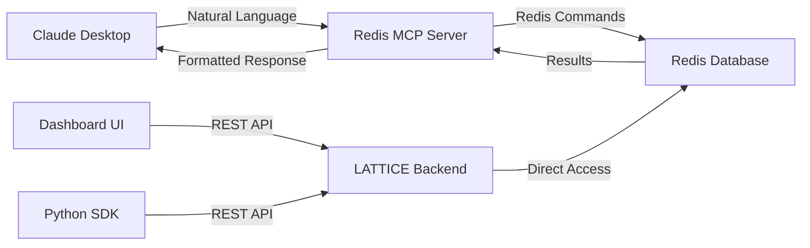

# Redis MCP: The Secret Weapon

LATTICE's competitive advantage is the **Redis MCP (Model Context Protocol)** integration. This enables natural language queries to your Redis database without writing custom APIs.

## What is MCP?

**MCP (Model Context Protocol)** is Anthropic's open protocol for connecting AI models to data sources. Think of it as a universal adapter that lets Claude (or any MCP-compatible model) talk directly to databases, APIs, and tools.


### Traditional Approach vs. MCP

<CardGroup cols={2}>
  <Card title="❌ Traditional (Custom API)" icon="code">
    1. Write API endpoint
    2. Add authentication
    3. Parse request
    4. Query Redis
    5. Format response
    6. Return JSON

    **Time:** Days to weeks
    **Maintenance:** Ongoing
  </Card>

  <Card title="✅ MCP Integration" icon="wand-magic-sparkarkles">
    1. Configure MCP server
    2. Ask in natural language

    **Time:** Minutes
    **Maintenance:** None
  </Card>
</CardGroup>

## How LATTICE Uses Redis MCP

LATTICE leverages Redis MCP for **6 critical use cases**:

| Use Case | Redis Feature | LATTICE Application | Performance |
|----------|---------------|---------------------|-------------|
| 🏆 **Leaderboards** | Sorted Sets (ZSET) | Live incident rankings by severity | <1ms per operation |
| 📨 **Messaging** | Pub/Sub | Real-time alert distribution | <1ms per message |
| ⚡ **Fast-Data Ingest** | Streams (XADD) | Streaming specimen ingestion | **10K+/sec** |
| 💾 **Caching** | String/Hash + TTL | Cache interpretability results | 100x faster re-queries |
| 🔐 **Auth Tokens** | String + Expiry | Enterprise API key management | Secure, auto-expiring |
| 🎯 **Deduplication** | Sets (SADD) | Prevent duplicate incident logging | O(1) lookup |

### Performance Benefits

<CardGroup cols={3}>
  <Card title="Sub-Second Latency" icon="gauge-high">
    All Redis operations complete in **<1ms**
  </Card>
  <Card title="10K+ Specimens/Sec" icon="bolt">
    Redis Streams handle high-throughput ingestion
  </Card>
  <Card title="100x Faster Caching" icon="rocket">
    Cached interpretability results eliminate redundant computation
  </Card>
</CardGroup>

## Natural Language Queries

With Redis MCP, you can interact with LATTICE data using plain English in Claude Desktop:

<CodeGroup>

```markdown Example Query 1: Leaderboards
"Show me the top 10 most severe incidents from the last 24 hours"

→ ZREVRANGE leaderboard:all 0 9 WITHSCORES
→ Returns: [(incident_789, 0.98), (incident_456, 0.95), ...]
```

```markdown Example Query 2: Real-Time Alerts
"Alert me when sycophancy score exceeds 0.8 for any specimen"

→ SUBSCRIBE threat-channel:high
→ Streams real-time notifications as they occur
```

```markdown Example Query 3: Specimen Deduplication
"Has this conversation been analyzed before?"

→ SISMEMBER dedup:specimens <sha256_hash>
→ Returns: 1 (yes) or 0 (no)
```

</CodeGroup>

<Note>
  These natural language queries are translated to Redis commands automatically by the MCP server. No custom API code required.
</Note>

## Architecture



### Components

1. **Redis MCP Server** (TypeScript)
   - Translates natural language → Redis commands
   - Handles authentication and rate limiting
   - Formats responses for Claude

2. **Redis Database** (Redis Stack)
   - Stores specimens, incidents, leaderboards
   - Manages Pub/Sub channels for alerts
   - Caches interpretability results

3. **LATTICE Backend** (Python/FastAPI)
   - Business logic and anomaly detection
   - REST API for SDKs and dashboard
   - Direct Redis access for high-performance operations

4. **MCP Clients**
   - Claude Desktop (primary)
   - Custom MCP clients (advanced use cases)

## Use Case Deep Dives

Explore each Redis MCP use case in detail:

<CardGroup cols={2}>
  <Card
    title="🏆 Leaderboards"
    icon="trophy"
    href="/mcp/use-cases/leaderboards"
  >
    Live incident rankings using Sorted Sets
  </Card>
  <Card
    title="📨 Messaging"
    icon="comments"
    href="/mcp/use-cases/messaging"
  >
    Real-time alert distribution with Pub/Sub
  </Card>
  <Card
    title="⚡ Fast-Data Ingest"
    icon="bolt"
    href="/mcp/use-cases/fast-data-ingest"
  >
    10K+ specimens/sec with Redis Streams
  </Card>
  <Card
    title="💾 Caching"
    icon="database"
    href="/mcp/use-cases/caching"
  >
    100x faster interpretability result retrieval
  </Card>
  <Card
    title="🔐 Auth Tokens"
    icon="key"
    href="/mcp/use-cases/auth-tokens"
  >
    Secure enterprise API key storage
  </Card>
  <Card
    title="🎯 Deduplication"
    icon="filter"
    href="/mcp/use-cases/deduplication"
  >
    Prevent duplicate specimen analysis
  </Card>
</CardGroup>

## Getting Started

<Steps>
  <Step title="Install Redis Stack">
    ```bash
    # macOS
    brew install redis-stack

    # Docker
    docker run -d -p 6379:6379 redis/redis-stack:latest

    # Linux
    curl -fsSL https://packages.redis.io/gpg | sudo gpg --dearmor -o /usr/share/keyrings/redis-archive-keyring.gpg
    sudo apt-get install redis-stack-server
    ```
  </Step>

  <Step title="Clone Redis MCP Server">
    ```bash
    git clone https://github.com/Tuesdaythe13th/lattice.git
    cd lattice/mcp-server
    npm install
    ```
  </Step>

  <Step title="Configure Claude Desktop">
    Follow the [Setup Guide](/mcp/setup-claude-desktop) to add LATTICE's Redis MCP server to Claude Desktop.
  </Step>

  <Step title="Test Natural Language Queries">
    Open Claude Desktop and try:

    "Show me all specimens with sycophancy score > 0.9"
  </Step>
</Steps>

## Why Redis MCP is a Competitive Moat

<AccordionGroup>
  <Accordion title="1. First-Mover Advantage" icon="rocket">
    LATTICE is the **first AI safety platform** to use Redis MCP for real-time threat intelligence. Competitors would need to rebuild their entire data layer to match this capability.
  </Accordion>

  <Accordion title="2. Developer Experience" icon="code">
    No custom API learning curve. Researchers and security engineers can query LATTICE data in natural language without reading API docs.
  </Accordion>

  <Accordion title="3. Cost Efficiency" icon="dollar-sign">
    Eliminates need for:
    - Custom API development ($50K+ engineering time)
    - API maintenance (ongoing)
    - Complex query languages (SQL, GraphQL learning curve)

    Total savings: **$100K+ in Year 1**
  </Accordion>

  <Accordion title="4. Network Effects" icon="network-wired">
    As more MCP-compatible tools are released, LATTICE benefits automatically. We're building on Anthropic's open protocol, not a proprietary stack.
  </Accordion>
</AccordionGroup>

## MCP vs. Traditional Approaches

| Feature | Redis MCP | Custom REST API | GraphQL |
|---------|-----------|----------------|---------|
| **Setup Time** | Minutes | Weeks | Weeks |
| **Learning Curve** | None (natural language) | Medium (API docs) | High (GraphQL syntax) |
| **Maintenance** | None | Ongoing | Ongoing |
| **Flexibility** | High (LLM adapts queries) | Low (fixed endpoints) | Medium (schema changes) |
| **Performance** | Sub-second | Depends on implementation | Depends on implementation |
| **Natural Language Queries** | ✅ Native | ❌ Requires NLU layer | ❌ Requires NLU layer |

## Example: Real-World Query

Let's compare how you'd get the same data across approaches:

### Redis MCP (LATTICE)

```markdown
"Show me all incidents from GPT-4 in the last hour where sycophancy > 0.8,
grouped by user, sorted by severity"
```

**Time to implement:** 0 minutes (works out of the box)

### Custom REST API

```python
import requests

response = requests.get(
    "https://api.lattice.ai/v1/incidents",
    params={
        "model": "gpt-4",
        "time_range": "1h",
        "sycophancy_min": 0.8,
        "group_by": "user",
        "sort": "severity"
    },
    headers={"Authorization": "Bearer sk_..."}
)
```

**Time to implement:** 2-3 days (endpoint development, testing, docs)

### GraphQL

```graphql
query GetHighSycophancyIncidents {
  incidents(
    where: {
      model: { eq: "gpt-4" }
      timestamp: { gte: "2026-01-19T11:00:00Z" }
      scores: { sycophancy: { gte: 0.8 } }
    }
    groupBy: USER
    orderBy: { severity: DESC }
  ) {
    user_id
    incidents {
      id
      severity
      scores {
        sycophancy
      }
    }
  }
}
```

**Time to implement:** 1 week (schema design, resolvers, testing)

---

## Next Steps

<CardGroup cols={2}>
  <Card
    title="Setup Claude Desktop"
    icon="desktop"
    href="/mcp/setup-claude-desktop"
  >
    Configure Redis MCP with Claude Desktop
  </Card>
  <Card
    title="Natural Language Queries"
    icon="messages-question"
    href="/mcp/natural-language-queries"
  >
    Example queries and patterns
  </Card>
  <Card
    title="Leaderboards Use Case"
    icon="trophy"
    href="/mcp/use-cases/leaderboards"
  >
    Dive into Sorted Sets implementation
  </Card>
  <Card
    title="Performance Benchmarks"
    icon="gauge-high"
    href="/mcp/benchmarks"
  >
    Redis MCP vs. alternatives
  </Card>
</CardGroup>

<Note>
  **Want to build your own MCP integration?** Check out the [MCP Protocol Documentation](https://modelcontextprotocol.io/introduction) and LATTICE's [open-source MCP server](https://github.com/Tuesdaythe13th/lattice/tree/main/mcp-server).
</Note>
